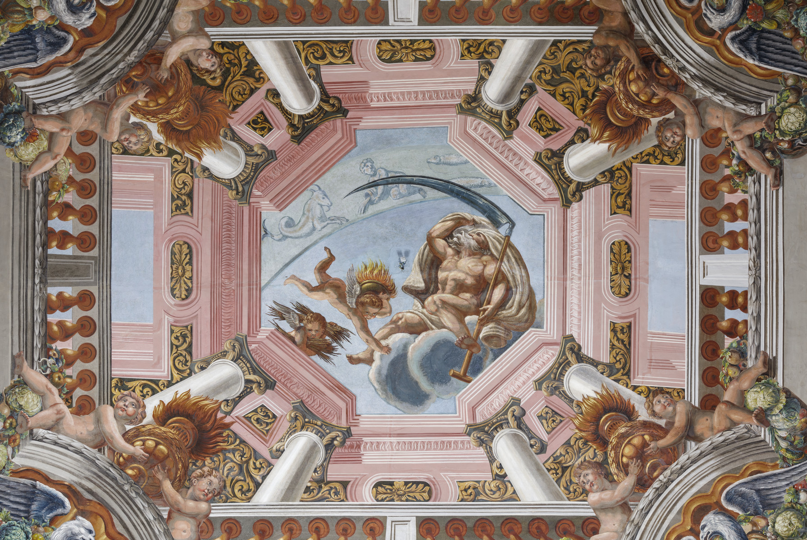
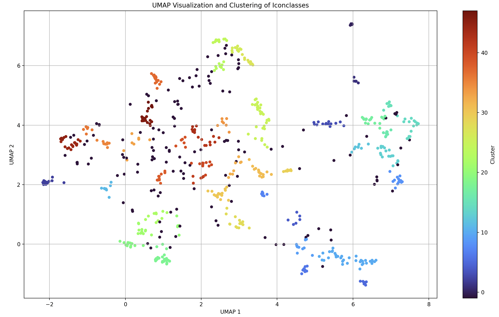
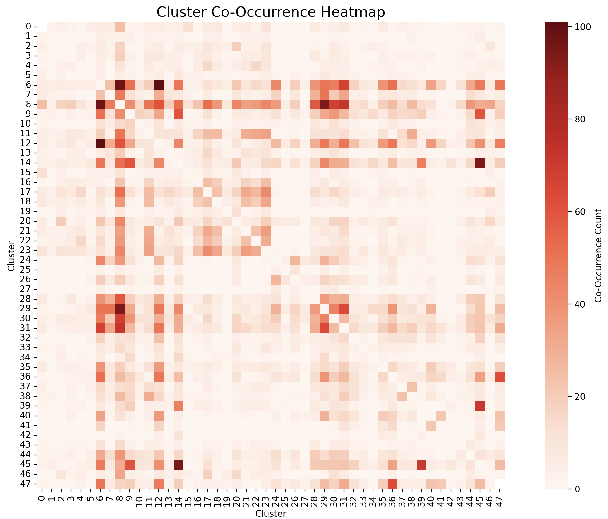

# A Data Story about analyzing research data on baroque artworks in Germany and their associated artists

/// html | div[class='tile']
**Authors:** Cristian Ghinea, Jacob Kühner, Niklas Spachmann
///
<br>
[](https://previous.bildindex.de/bilder/fmd494334a.jpg)
/// caption
Tommasso Guisti, Die Decke im Zimmer des Winters, 1696-1698, [CbDD](https://www.deckenmalerei.eu/7811eafd-4f5f-4b17-96c7-d0d9ab35f530), Public Domain
///


## Abstract
This data story explores the world of Baroque ceiling paintings in Germany through the lens of digital methods. Drawing on the Corpus of Baroque Ceiling Paintings in Germany (CbDD, see also [deckenmalerei.eu](https://deckenmalerei.eu) and, where possible, the Bildindex der Kunst & Architektur, it examines artworks from multiple perspectives. By combining structured queries with semantic clustering of iconographic data, the analysis reveals both the diversity and recurring patterns of Baroque imagery. In addition, large language models were used to support in tasks such as interpretation of depicted motifs across artworks or narrative storytelling from the perspective of historical artists. The data story demonstrates how digital approaches, together with generative AI, can complement art-historical expertise.

## Introduction
Art has always been more than decoration: it reflects the values, beliefs and ambitions of the societies that created it. In early modern Europe, this role was taken to new heights in the Baroque period, when painting, architecture and sculpture merged into immersive experiences. Among the most striking examples are Baroque ceiling paintings, which transformed churches, palaces and civic buildings into vast visual spectacles.
This data story explores the world of Baroque ceiling paintings from multiple perspectives, examining locations, materials and techniques, artists and motifs depicted.

## Methodology
We structured our workflow following the Knowledge Discovery in Databases (KDD) process, an established framework in database research.
This project's main source is the Corpus of Baroque Ceiling Paintings in Germany (CbDD), a research project within the Academies’ Programme of the Union of the German Academies of Sciences and Humanities. It is supervised by the Bavarian Academy of Sciences and Humanities in Munich and brings together information on more than 4,000 paintings from ceilings and buildings across Germany, dating from the 16th to the late 18th century.
In addition to the CbDD dataset, we intended to integrate the Bildindex der Kunst & Architektur, a large and open image database run by the German Documentation Center for Art History (Bildarchiv Foto Marburg). It contains over 3.2 million photographs of roughly 1.9 million art and architectural objects across Europe. Originally, our plan was to link the two datasets to cross-filter and enrich analyses. However, after multiple iterations, we discovered this was not feasible with sufficient reliability. This is due to incomplete overlap, mismatched identifiers and varying levels of metadata.
As a result, the core analyses are conducted on the CbDD corpus, while the Bildindex is used opportunistically at points where it can provide interesting additions.
Both datasets are integrated into the NFDI4Culture Knowledge Graph.

## Results
### Historical buildings
In the first step, the basic structure of the CbDD-dataset was explored. Alongside with Visual Artworks, the data also includes the buildings in which these artworks are located in. To better understand this context, we ran a query to examine the types of buildings represented in the dataset, such as palaces, churches and others.

/// details | **Show SPARQL query 1**
    type: plain
``` sparql linenums="1" title="sparql-1.rq"
--8<-- "sparql-1.rq"
```
///

/// details | **Show query result 1**
    type: plain
``` shmarql linenums="1" title="sparql-1.rq"
--8<-- "sparql-1.rq"
```
///

### Artworks by creator
The following analysis focussed on the artworks and their associated artists. A query was used to identify which creators are represented in the dataset and how many artworks are attributed to each of them. Preliminary results showed that 2,632 artworks have an assigned creator, while 2,482 artworks remain without a creator.

/// details | **Show SPARQL query 2**
    type: plain
``` sparql linenums="1" title="sparql-2.rq"
--8<-- "sparql-2.rq"
```
///

/// details | **Show query result 2**
    type: plain
``` shmarql linenums="1" title="sparql-2.rq"
--8<-- "sparql-2.rq"
```
///

### Artworks by artform
In the next step, the focus was shifted directly to the artworks. In particular, the following analysis looks at their artform, which involves the artistic techniques in their creation. Investigating these values provides insights into dominant practices within the dataset and highlights the diversity of methods represented.

/// details | **Show SPARQL query 3**
    type: plain
``` sparql linenums="1" title="sparql-3.rq"
--8<-- "sparql-3.rq"
```
///

/// details | **Show query result 3**
    type: plain
``` shmarql linenums="1" title="sparql-3.rq"
--8<-- "sparql-3.rq"
```
///

### Artworks by artmedium
After considering the artistic techniques, the analysis proceeds to physical materials on which or with which the artworks were produced. Examining these artmedium values offers a complementary perspective, providing valuable insights in understanding how these artworks were made as well as capturing their material foundation.

/// details | **Show SPARQL query 4**
    type: plain
``` sparql linenums="1" title="sparql-4.rq"
--8<-- "sparql-4.rq"
```
///

/// details | **Show query result 4**
    type: plain
``` shmarql linenums="1" title="sparql-4.rq"
--8<-- "sparql-4.rq"
```
///

### Artworks by creation period
A closer look at the dataset also reveals its temporal dimension across the baroque age, which can be seen in the query underneath. It should be noted that there are some inconsistencies in the creation period data, as some entries provide exact years or decades while others only contain broader intervals or textual descriptions.

/// details | **Show SPARQL query 5**
    type: plain
``` sparql linenums="1" title="sparql-5.rq"
--8<-- "sparql-5.rq"
```
///

/// details | **Show query result 5**
    type: plain
``` shmarql linenums="1" title="sparql-5.rq"
--8<-- "sparql-5.rq"
```
///

### Additional insights from Bildindex der Kunst & Architektur

In addition to the existing artworks from CbDD, we want to further discover artworks that artists of the dataset have created. Therefore, the database [Bildindex der Kunst & Architektur](https://www.bildindex.de/) is being examined. While the website doesn't provide a SPARQL endpoint, artworks of artists from CbDD are being found by the following queries, which are being executed on the NFDI4Culture knowledge graph:

#### Amount of artworks from CbDD, Bildindex, and total amount of artworks per artist
This query counts all artworks grouped by each artist and sorted in a descending order. It also differentiates between artworks found in the CbDD dataset, as well as the ones that are being found in the Bildindex dataset. When counting all artworks in both datasets, duplicates may occur, which are then counted and can slightly skew the results of the counts. This is because there is no SPARQL endpoint in the image index and the names of the entities in the two datasets may differ despite the artworks being identical. Furthermore, the query in the image index datasets cannot distinguish whether the entities are the artwork itself, a section of the artwork, or an image of an artwork. Therefore, the figures should only be seen as guidelines and not as definitive results.

/// details | **Show SPARQL query 6**
    type: plain
``` sparql linenums="1" title="sparql-6.rq"
--8<-- "sparql-6.rq"
```
///

/// details | **Show query result 6**
    type: plain
``` shmarql linenums="1" title="sparql-6.rq"
--8<-- "sparql-6.rq"
```
///

#### Additional artworks from Bildindex der Kunst & Architektur
To find additional artworks from the Bildindex dataset, the following SPARQL query is being used. By looking into the links at column 'bildindexEntity' one can find additional insights to his or her artist of interest, such as other artworks that are not included in the CbDD dataset, additional images from different perspectives or in different scales, historical information, such as when photographers took pictures of an artwork, who the photographers were, additional notes on the artwork, etc.

/// details | **Show SPARQL query 7**
    type: plain
``` sparql linenums="1" title="sparql-7.rq"
--8<-- "sparql-7.rq"
```
///

<p style="color: gray; font-style: italic;">
  Hint: The query loading time may be longer due to large amounts of data (approximately 11,700 Bildindex entries).
</p>

/// details | **Show query result 7**
    type: plain
``` shmarql linenums="1" title="sparql-7.rq"
--8<-- "sparql-7.rq"
```
///

## Analysis of Iconclasses
Most artworks in our corpus carry Iconclass annotations. These codes refer to the specific motifs depicted in the artworks. In total, about 4300 individual iconclass-codes can be found over all artworks. Although Iconclass is hierarchical, its code length varies (e.g. a dog is 34B11, while a horse is 46C13141). Additionally, semantically related motifs can sit at different branches (e.g. flowers is 25G41, while flowers in a vase is 41A6711). Given these aspects, an analysis using the iconclass hierarchy over all individual identifiers did not look promising.
Instead, a semantic clustering to better understand the themes and scenes depicted was applied.
In a first step, we extracted all Iconclass codes of the CbDD dataset and enriched them with their textual descriptions via the Iconclass API (it should be noted, that we restricted the analysis to Iconclasses that occur at least five times across all artworks, reducing the initial set of about 4,300 to 711 frequently used Iconclasses).To capture semantic similarity, the descriptions were converted into vector embeddings with 384 dimensions using the all-mini-L6-v2 model.
On this basis, HDB Clustering was applied, grouping the Iconclasses into thematically coherent clusters with a minimum cluster size of five Iconclasses. From there, we could determine which clusters are represented in each artwork: for example, if artwork x contained Iconclasses 1, 2 and 3, belonging to clusters a, b and c, then artwork x could be described by these thematic clusters. This shift in perspective allowed us to move from highly specific codes to broader thematic categories, making the dataset more interpretable.
The resulting Clusters can be found in the figure underneath, where we projected the Iconclasses with UMAP. Each point represents one Iconclass description embedded in the semantic space, with the colors indicating the assigned cluster. The dark blue points (cluster -1) are outliers that HDBSCAN did not assign to any cluster.


/// caption
Image 1: Visualization and Clustering of Iconclasses
///

Building on this, we computed how often clusters occur together within the same artwork and summarized the results as a co-occurrence heatmap in the figure underneath. The heatmap highlights stable thematic links across the collection.


/// caption
Image 2: Cluster Co-Occurrence Heatmap
///

Following the co-occurrence heatmap, we present two summary tables for a more detailed view.
To make the results more interpretable, we used generative AI to suggest concise names for the clusters based on the Iconclass descriptions they contained. This step allows us to move from technical identifiers to meaningful thematic categories.

The first table lists the ten most frequent co-occurrences of clusters, highlighting which thematic combinations appear together most often.

| Cluster1                               | Cluster2                                 | Count |
|----------------------------------------|------------------------------------------|-------|
| Celestial Phenomena and Light          | Sacred trees and forests                  |   101 |
| Celestial Phenomena and Light          | Depiction of Cupids                       |    98 |
| Symbols of Sovereignty                 | Armour and military clothing              |    95 |
| Depiction of Cupids                    | Baroque Ornamental Motifs and Decorations |    94 |
| Depiction of Cupids                    | Ornamental and Symbolic Birds             |    72 |
| Iconography of hair and masks          | Armour and military clothing              |    71 |
| Depiction of Cupids                    | Musical Instruments and Motifs            |    68 |
| Celestial Phenomena and Light          | Ornamental and Symbolic Birds             |    67 |
| Baroque Ornamental Motifs and Decorations | Ornamental and Symbolic Birds           |    64 |
| Classical Architectural Motifs         | Castles and decorative interior           |    63 |
/// caption
Table 1: Number of co-ocurrences
///

The second table extends this perspective to triadic co-occurrences, showing the ten most common constellations of three clusters found within the same artwork.

| Cluster1                      | Cluster2                       | Cluster3                           | Count |
|-------------------------------|--------------------------------|------------------------------------|-------|
| Symbols of Sovereignty        | Iconography of hair and masks  | Armour and military clothing       |    43 |
| Celestial Phenomena and Light | Sacred trees and forests       | Classical Architectural Motifs     |    36 |
| Celestial Phenomena and Light | Classical Architectural Motifs | Castles and decorative interior    |    35 |
| Celestial Phenomena and Light | Sacred trees and forests       | Castles and decorative interior    |    35 |
| Sacred trees and forests      | Classical Architectural Motifs | Castles and decorative interior    |    35 |
| Weapons                       | Symbols of Sovereignty         | Armour and military clothing       |    34 |
| Celestial Phenomena and Light | Depiction of Cupids            | Ornamental and Symbolic Birds      |    27 |
| Celestial Phenomena and Light | Sacred trees and forests       | Armour and military clothing       |    27 |
| Celestial Phenomena and Light | Depiction of Cupids            | Weapons                            |    26 |
| Celestial Phenomena and Light | Depiction of Cupids            | Musical Instruments and Motifs     |    26 |
/// caption
Table 2: Number of triadic co-ocurrences
///

## Baroque ceiling paintings in Germany illutrated in an interactive map
This map illustrates all the locations of ceiling paintings that are being found in the CbDD dataset. After clicking on one of the buttons, a list of all artworks at this location, its artist, and a thumbnail of the artwork appears. To see the artwork at a higher scale, a click directs to another tab, where a fullscreen version can be seen.
<br>
Originally, there has been the idea to connect those locations with locations of artworks from the Bildindex dataset. Due to current technical limitations with the SPARQL endpoint and federated queries this connection cannot be made, that is the coordinates cannot be fetched. In the project file, there is a first draft to also retrieve coordinates from the Bildindex dataset.

<p style="color: gray; font-style: italic;">
  Hint: The loading time may be longer due to large amounts of data.
</p>

<div id="map" style="height: 70vh; border-radius: 8px; margin: 1rem 0;"></div>

<!-- Leaflet CSS/JS (from CDN) -->
<link rel="stylesheet" href="https://unpkg.com/leaflet@1.9.4/dist/leaflet.css"
      integrity="sha256-p4NxAoJBhIIN+hmNHrzRCf9tD/miZyoHS5obTRR9BMY=" crossorigin="">
<script src="https://unpkg.com/leaflet@1.9.4/dist/leaflet.js"
        integrity="sha256-20nQCchB9co0qIjJZRGuk2/Z9VM+kNiyxNV1lvTlZBo=" crossorigin=""></script>

<!-- Add custom styles for cluster-count icons and popup list -->
<style>
  /* cluster count icon */
  .cluster-count {
    display: inline-flex;
    align-items: center;
    justify-content: center;
    background: rgba(0,120,200,0.95);
    color: white;
    border-radius: 50%;
    width: 30px;
    height: 30px;
    font-weight: 600;
    box-shadow: 0 1px 4px rgba(0,0,0,0.6);
    border: 2px solid white;
  }
  .single-marker-dot {
    width: 12px;
    height: 12px;
    background: rgba(0,120,200,0.95);
    border-radius: 50%;
    border: 2px solid white;
    box-shadow: 0 1px 3px rgba(0,0,0,0.6);
  }

  /* popup contents: fixed size and scrollable */
  /* widened to make space for thumbnails on the right */
  .popup-list {
    width: 520px;     /* increased from 320 to allow image column */
    height: 300px;
    overflow-y: auto;
    box-sizing: border-box;
    padding: 0.4rem;
    font-size: 0.9rem;
  }

  /* each item is a two-column row: meta (left) + thumbnail (right) */
  .popup-list .item {
    display: flex;
    gap: 0.6rem;
    align-items: center; /* fixed square thumbs, don't stretch with text */
    margin-bottom: 0.5rem;
    border-bottom: 1px solid #eee;
    padding-bottom: 0.35rem;
  }

  .popup-list .item .meta {
    flex: 1 1 auto;
    min-width: 0; /* for proper word-wrap inside flex */
  }
  .popup-list .item .meta strong { display:block; font-weight:600; margin-bottom:0.15rem; }

  /* thumbnail column */
  .popup-list .item .thumb-wrap {
    width: 160px;           /* thumbnail width (square) */
    height: 160px;          /* fixed square height -> 1:1 aspect ratio */
    flex: 0 0 160px;
    display: flex;
    align-items: center;
    justify-content: center;
    overflow: hidden;       /* hide parts outside the square */
    border-radius: 4px;
    box-shadow: 0 1px 3px rgba(0,0,0,0.12);
    border: 1px solid #ddd;
    background: #fff;
  }
  .popup-list .item .thumb {
    width: 100%;
    height: 100%;
    object-fit: cover;      /* crop & fill the square */
    object-position: center center; /* center the image inside the square */
    display: block;
    border-radius: 0;       /* rounded container already applied to wrapper */
  }

  .popup-list a { color: #065a8a; word-break: break-all; }
</style>

<script>
(async function () {
  // 1) Create the map
  const map = L.map('map', { scrollWheelZoom: true }).setView([51.2, 10.4], 6);
  L.tileLayer('https://{s}.tile.openstreetmap.org/{z}/{x}/{y}.png', {
    maxZoom: 18,
    attribution: '&copy; OpenStreetMap contributors'
  }).addTo(map);

  // 2) SPARQL code
  const sparql = `
  PREFIX rdfs: <http://www.w3.org/2000/01/rdf-schema#>
  PREFIX schema: <http://schema.org/>
  PREFIX geo: <http://www.w3.org/2003/01/geo/wgs84_pos#>
  PREFIX geos: <http://www.opengis.net/ont/geosparql#>
  PREFIX xsd: <http://www.w3.org/2001/XMLSchema#>
  PREFIX cto: <https://nfdi4culture.de/ontology#>
  PREFIX nfdi4culture: <https://nfdi4culture.de/id/>
  PREFIX gndo: <https://d-nb.info/standards/elementset/gnd#>

  SELECT DISTINCT
    ?creatorGND
    ?art    ?eLoc    ?eLat    ?eLon    ?nameArtist    ?nameLoc
    ?bild   ?bLoc    ?bLat    ?bLon    ?nameArt    ?imgUrl
  WHERE {
    ## 1) Test auf 5 verschiedene Künstler-GNDs
    {
      SELECT DISTINCT ?creatorGND WHERE {
        ?art cto:elementOf nfdi4culture:E6077 ;
            a/rdfs:subClassOf* schema:VisualArtwork ;
            (schema:creator|schema:artist) ?creatorGND .
      }
      LIMIT 999
    }

    ## 2) E6077 artwork
    ?art cto:elementOf nfdi4culture:E6077 ;
        (schema:creator|schema:artist) ?creatorGND .

    # try to get a deckenmalerei location
    OPTIONAL {
      ?art cto:relatedLocation ?deckLoc .
      FILTER (STRSTARTS(STR(?deckLoc), "https://www.deckenmalerei.eu/"))
    }

    # fallback: a GND location
    OPTIONAL {
      ?art cto:relatedLocation ?gndLoc .
      FILTER STRSTARTS(STR(?gndLoc), "https://d-nb.info/gnd/")
    }

    # pick deckenmalerei if present, otherwise GND
    BIND( COALESCE(?deckLoc, ?gndLoc) AS ?eLoc )
    FILTER(BOUND(?eLoc))

    ## Direct coordinates (deckenmalerei.eu etc.)
    OPTIONAL {
      ?eLoc schema:latitude  ?eLat ;
            schema:longitude ?eLon .
    }
    ?creatorGND rdfs:label ?nameArtist .
    ?art rdfs:label ?nameArt .
    ?eLoc rdfs:label ?nameLoc .
    ?art schema:image ?imgUrl .

    ## 3) Bildindex-Einträge desselben Künstlers + Location
    ?bild ?predicate ?creatorGND .
    FILTER (STRSTARTS(STR(?bild), "http://www.bildindex.de/"))

    OPTIONAL {
      ?bild cto:relatedLocation ?bLoc .

      ## direkte Koordinaten am bLoc
      OPTIONAL {
        SERVICE SILENT <https://zbw.eu/beta/sparql-lab/sparql> {
          ?bLoc gndo:place ?place.
          ?place  geos:hasGeometry ?geom .
          ?geom   geos:asWKT ?bWKT .
        }
      }
    }
  }
  ORDER BY ?creatorGND
  `;

  // 3) Query the same-origin /sparql exposed by SHMARQL
  const res = await fetch('http://localhost:5001/sparql', {

    method: 'POST',
    headers: {
      'Accept': 'application/sparql-results+json',
      'Content-Type': 'application/x-www-form-urlencoded;charset=UTF-8'
    },
    body: new URLSearchParams({ query: sparql })
  });
  if (!res.ok) {
    console.error('SPARQL error', res.status, await res.text());
    return;
  }
  const json = await res.json();

  // helper: robust number parsing (accept "49.2", "49,2", trim)
  function toNumber(val) {
    if (val == null) return null;
    const s = String(val).trim().replace(',', '.');
    const n = Number(s);
    return Number.isFinite(n) ? n : null;
  }

  // 4) Transform rows -> grouped markers
  const rows = json.results?.bindings || [];
  const groups = new Map(); // key "lat,lon" => array of row objects

  for (const row of rows) {
    const rawLat = row.eLat?.value ?? null;
    const rawLon = row.eLon?.value ?? null;
    const latNum = toNumber(rawLat);
    const lonNum = toNumber(rawLon);
    if (latNum == null || lonNum == null) continue;

    const key = `${latNum.toFixed(6)},${lonNum.toFixed(6)}`; // stable key
    if (!groups.has(key)) groups.set(key, { lat: latNum, lon: lonNum, rows: [] });
    groups.get(key).rows.push(row);
  }

  const markers = [];
  for (const [key, g] of groups.entries()) {
    // dedupe rows for this location so count and popup reflect unique entries
    const seenLocation = new Set();
    const dedupRows = [];
    for (const r of g.rows) {
      const artUri = (r.art?.value || '').trim();
      const artName = (r.nameArt?.value || '').trim();
      const artistUri = (r.creatorGND?.value || '').trim();
      const artistName = (r.nameArtist?.value || '').trim();
      const locUri = (r.eLoc?.value || '').trim();
      const locName = (r.nameLoc?.value || '').trim();
      const k = `${artUri}|${artName}|${artistUri}|${artistName}|${locUri}|${locName}`;
      if (seenLocation.has(k)) continue;
      seenLocation.add(k);
      dedupRows.push(r);
    }

    const count = dedupRows.length;
    if (count === 0) continue; // nothing to show

    let icon;
    if (count > 1) {
      icon = L.divIcon({
        className: '',
        html: `<div class="cluster-count">${count}</div>`,
        iconSize: [30, 30],
        iconAnchor: [15, 15]
      });
    } else {
      icon = L.divIcon({
        className: '',
        html: `<div class="single-marker-dot"></div>`,
        iconSize: [18, 18],
        iconAnchor: [9, 9]
      });
    }

    const latlng = L.latLng(g.lat, g.lon);
    const m = L.marker(latlng, { icon }).addTo(map);
    // attach deduped rows to the marker for use in the popup
    m._dedupRows = dedupRows;

    // click handler shows a fixed-size scrollable popup with the list of unique entries
    m.on('click', function () {
        // prepare popup HTML
        // small helper to avoid injecting raw HTML from labels
        function escapeHtml(s) {
          return String(s || '').replace(/[&<>"']/g, function (c) {
            return ({'&':'&amp;','<':'&lt;','>':'&gt;','"':'&quot;',"'":'&#39;'}[c]);
          });
        }

        const rowsForPopup = this._dedupRows || [];
        const items = rowsForPopup.map(r => {
          const nameArt = r.nameArt?.value || '—';
          const nameLoc = r.nameLoc?.value || '—';
          const nameArtist = r.nameArtist?.value || '—';

          // prefer ?imgUrl (from your SPARQL), fall back to other vars if present
          const imgUrl = (r.imgUrl?.value || r.bildImage?.value || r.bild?.value || '').trim();

          // quick image test (jpg/png/gif/webp)
          const isImage = /\.(jpe?g|png|gif|webp|svg)(\?|$)/i.test(imgUrl);

          const metaHtml = `<div class="meta">
            <div><strong>Artwork</strong>${escapeHtml(nameArt)}</div>
            <div><strong>Location</strong>${escapeHtml(nameLoc)}</div>
            <div><strong>Artist</strong>${escapeHtml(nameArtist)}</div>
          </div>`;

          const thumbHtml = isImage
            ? `<div class="thumb-wrap"><a href="${escapeHtml(imgUrl)}" target="_blank" rel="noopener"></a></div>`
            : `<div class="thumb-wrap"></div>`;

          return `<div class="item">${metaHtml}${thumbHtml}</div>`;
        });
        const itemsHtml = items.join('');
        const popupContent = `<div class="popup-list">${itemsHtml}</div>`;

        const popupWidth = 520;    // must match .popup-list width
        const popupHeight = 300;   // must match .popup-list height
        const margin = 12;         // padding between popup and map border

        const mapSize = map.getSize();
        const markerPoint = map.latLngToContainerPoint(latlng);

        // horizontal
        const minX = popupWidth / 2 + margin;
        const maxX = Math.max(mapSize.x - popupWidth / 2 - margin, minX);
        const desiredX = Math.min(Math.max(markerPoint.x, minX), maxX);

        // vertical: popup is shown above the marker, so top of popup will be marker.y - popupHeight.
        const minY = popupHeight + margin;
        const maxY = Math.max(mapSize.y - margin, minY);
        const desiredY = Math.min(Math.max(markerPoint.y, minY), maxY);

        const delta = L.point(desiredX - markerPoint.x, desiredY - markerPoint.y);

        // open popup after panning (if needed)
        map.once('moveend', () => {
          const popup = L.popup({
            maxWidth: popupWidth + 40,
            minWidth: 200,
            closeButton: true,
            autoPan: false // handle panning manually
          })
          .setLatLng(latlng)
          .setContent(popupContent)
          .openOn(map);
        });

        if (Math.abs(delta.x) < 1 && Math.abs(delta.y) < 1) {
          map.fire('moveend');
        } else {
          map.panBy(L.point(delta.x, -delta.y * 1.3), { animate: true, duration: 0.25 });
        }
      });

    markers.push(m);
  }

  // 5) Fit map to markers if there are any
  if (markers.length) {
    const group = L.featureGroup(markers);
    map.fitBounds(group.getBounds().pad(0.2));
  } else {
    console.warn('No markers created - check SPARQL response for eLat/eLon bindings. See console logs.');
  }
})();
  
</script>

## An Interactive Exploration: The AI Artist Storyteller
To move beyond traditional data visualization and offer a more narrative perspective on our dataset, we developed an interactive tool that brings the artists within the knowledge graph to life. This component allows users to select an artist and dynamically generate a short, first-person story that recounts their career and achievements based on the available factual data.

The process is driven by a combination of live data retrieval and generative AI. Here is a brief overview of the workflow:

1.  **Data Retrieval:** When an artist is selected, the browser sends a SPARQL query to our knowledge graph via a Python Flask proxy. This query gathers key information about the artist's known works, including their creation periods, funders, art forms, and mediums.
2.  **Prompt Engineering:** The retrieved data is formatted into a structured text. This text is then sent to our backend and embedded into a carefully designed prompt, which instructs the AI to act as the selected artist. The prompt specifically directs the model to create a concise, factual account using *only* the data provided.
3.  **AI-Powered Generation:** The backend uses the Groq API to pass the complete prompt to the `meta-llama/llama-4-scout-17b-16e-instruct` model. The AI then synthesizes the factual data into a cohesive, first-person narrative.
4.  **Display:** The final story is returned to the user's browser and displayed, offering an engaging and personal glimpse into the artist's life and work as represented in our data.

This interactive page brings the data from the knowledge graph to life. Select an artist from the list, and an AI will generate a unique story from their perspective, based on real data about their works, funders, and places of activity.

<div class="llm-interactive-area">
    <p><b>1. Select an Artist:</b></p>
    <select id="artist-select" disabled>
        <option>Loading artists from the knowledge graph...</option>
    </select>

    <button id="generate-story-btn" disabled><b>2. Generate Story</b></button>
    <hr>
    <h3>The Story of...</h3>
    <div id="story-output">
        <p>Please select an artist and click "Generate Story".</p>
    </div>
</div>

<style>
    .llm-interactive-area {
        background-color: #f9f9f9;
        border: 1px solid #ddd;
        padding: 20px;
        border-radius: 8px;
        font-family: sans-serif;
    }
    #artist-select {
        width: 100%;
        padding: 10px;
        margin-bottom: 15px;
        border-radius: 4px;
        border: 1px solid #ccc;
        background-color: white;
    }
    #generate-story-btn {
        padding: 12px 18px;
        font-size: 16px;
        background-color: #007bff;
        color: white;
        border: none;
        border-radius: 4px;
        cursor: pointer;
        transition: background-color 0.2s;
    }
    #generate-story-btn:disabled {
        background-color: #cccccc;
        cursor: not-allowed;
    }
    #generate-story-btn:hover:not(:disabled) {
        background-color: #0056b3;
    }
    #story-output {
        margin-top: 20px;
        padding: 15px;
        background-color: white;
        border: 1px solid #eee;
        border-radius: 4px;
        white-space: pre-wrap;
        line-height: 1.6;
        min-height: 100px;
    }
</style>

<script>
    (() => {
        // --- CONFIGURATION ---
        const SPARQL_PROXY_ENDPOINT = "http://localhost:5001/sparql";
        const AI_BACKEND_ENDPOINT = "http://localhost:5001/generate-story";

        // --- DOM ELEMENTS ---
        const artistSelect = document.getElementById('artist-select');
        const generateBtn = document.getElementById('generate-story-btn');
        const storyOutput = document.getElementById('story-output');

        /**
         * A reusable function to safely send SPARQL queries via the backend proxy.
         * @param {string} query - The SPARQL query.
         * @returns {Promise<Array>} - A promise that resolves with the results (bindings).
         */
        async function querySparql(query) {
            const url = new URL(SPARQL_PROXY_ENDPOINT);
            url.searchParams.append('query', query);
            url.searchParams.append('format', 'json');
            
            const response = await fetch(url, { headers: { 'Accept': 'application/sparql-results+json' } });
            
            if (!response.ok) {
                const errorText = await response.text();
                throw new Error(`SPARQL query failed with status ${response.status}: ${errorText}`);
            }
            const json = await response.json();
            return json?.results?.bindings || [];
        }

        /**
         * Populates the dropdown menu with all artists from the dataset.
         */
        async function populateArtistsDropdown() {
            // *** CORRECTED QUERY ***
            // This query now uses schema:VisualArtwork and schema:creator as per your data model.
            const artistQuery = `
                PREFIX schema: <http://schema.org/>
                PREFIX rdfs: <http://www.w3.org/2000/01/rdf-schema#>
                SELECT DISTINCT ?artist ?artistLabel WHERE {
                    ?work a schema:VisualArtwork ;
                          schema:creator ?artist .
                    ?artist rdfs:label ?artistLabel .
                } ORDER BY ?artistLabel`;
            
            try {
                const artists = await querySparql(artistQuery);
                if (artists.length === 0) {
                    artistSelect.innerHTML = '<option>No artists found.</option>';
                    return;
                }
                artistSelect.innerHTML = '<option value="">-- Please select an artist --</option>';
                artists.forEach(artist => {
                    if (artist.artist?.value && artist.artistLabel?.value) {
                        const option = document.createElement('option');
                        option.value = artist.artist.value;
                        option.textContent = artist.artistLabel.value;
                        artistSelect.appendChild(option);
                    }
                });
                artistSelect.disabled = false;
                generateBtn.disabled = false;
            } catch (error) {
                console.error("Error populating the artist list:", error);
                artistSelect.innerHTML = '<option>Error loading artists</option>';
            }
        }
        
        async function generateStoryWorkflow() {
            const artistUri = artistSelect.value;
            const artistName = artistSelect.options[artistSelect.selectedIndex].text;
            if (!artistUri) {
                storyOutput.innerHTML = "<p>Please select an artist from the list first.</p>";
                return;
            }
            storyOutput.innerHTML = "<p>Gathering data and contacting the AI... please wait...</p>";
            generateBtn.disabled = true;

            try {
                // *** CORRECTED QUERY ***
                // This query now also uses schema:creator to find the works for the selected artist.
                const artworksQuery = `
                    PREFIX schema: <http://schema.org/>
                    PREFIX rdfs: <http://www.w3.org/2000/01/rdf-schema#>
                    PREFIX cto: <https://nfdi4culture.de/ontology#>
                    SELECT DISTINCT ?workLabel ?funderLabel ?creationPeriod ?artform ?artMedium
                    WHERE {
                        ?work schema:creator <${artistUri}> .
                        
                        OPTIONAL { ?work rdfs:label ?workLabel . }
                        OPTIONAL { 
                            ?work schema:funder ?funder . 
                            ?funder rdfs:label ?funderLabel . 
                        }
                        OPTIONAL { ?work cto:creationPeriod ?creationPeriod . }
                        OPTIONAL { ?work schema:artform ?artform . }
                        OPTIONAL { ?work schema:artMedium ?artMedium . }
                    } 
                    LIMIT 150`;
                const artworkResults = await querySparql(artworksQuery);
                if (artworkResults.length === 0) {
                    storyOutput.innerHTML = '<p>No detailed artwork data could be found for this artist to generate a story.</p>';
                    generateBtn.disabled = false;
                    return;
                }
                const formattedData = artworkResults.map(r => {
                    let parts = [];
                    if (r.workLabel?.value) parts.push(`my work "${r.workLabel.value}"`);
                    if (r.creationPeriod?.value) parts.push(`created in the period of "${r.creationPeriod.value}"`);
                    if (r.artform?.value) parts.push(`using the art form "${r.artform.value}"`);
                    if (r.artMedium?.value) parts.push(`with the medium "${r.artMedium.value}"`);
                    if (r.funderLabel?.value) parts.push(`funded by ${r.funderLabel.value}`);
                    return `- ${parts.join(', ')}`;
                }).join('\\n');

                const aiResponse = await fetch(AI_BACKEND_ENDPOINT, {
                    method: 'POST',
                    headers: { 'Content-Type': 'application/json' },
                    body: JSON.stringify({ artistName, artistData: formattedData })
                });
                if (!aiResponse.ok) throw new Error(`Backend API call failed with status ${aiResponse.status}`);
                const storyData = await aiResponse.json();
                storyOutput.innerHTML = storyData.story;
            } catch (error) {
                console.error("Error in story generation workflow:", error);
                storyOutput.innerHTML = `<p style="color: red;">An error occurred. Please check the browser console for details.</p>`;
            } finally {
                generateBtn.disabled = false;
            }
        }

        // --- INITIALIZATION ---
        generateBtn.addEventListener('click', generateStoryWorkflow);
        populateArtistsDropdown();
    })();
</script>
<br>
## Conclusion
This data story shows how Baroque ceiling paintings in Germany can be studied not only as individual works of art but also as part of larger patterns, highlighting their richness and diversity. By looking at the artworks from different perspectives, it was possible to build a multifaceted picture of this topic. These perspectives ranged from different locations over thematic motifs to artists and their careers.
The analyses revealed both the variety of approaches and contexts in which these works were created and at the same time recurring structures and shared features of artworks that point to common trends in that age.
Beyond individual details, this data story demonstrates how combining art-historical expertise with digital methods makes it possible to uncover connections, recognize patterns and generate new insights into the broad landscape of baroque art in Germany.

## Limitations and outlook
Nevertheless, our story is shaped by the scope and structure of the available datasets. For many artworks, information on aspects such as artists, materials or techniques was missing, limiting the possibilities for analyses. Additionally, reducing complex iconographic descriptions to clusters also entails a loss in level of detail.
Future projects could benefit from the integration of different data sources. This would not only improve overall data quality, but also open up new potential for comparative and cross-contextual analyses. These possibilities range from artistic networks over patronage to regional traditions, offering valuable insights into art of the baroque era.
